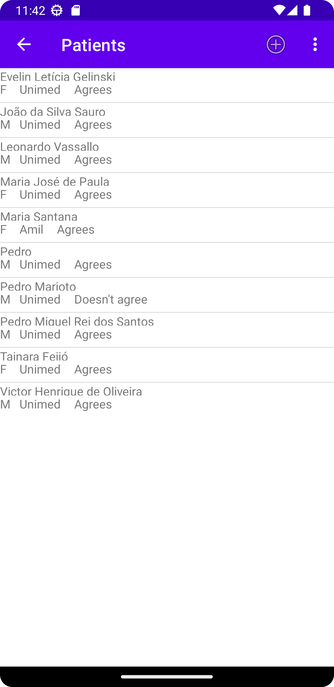
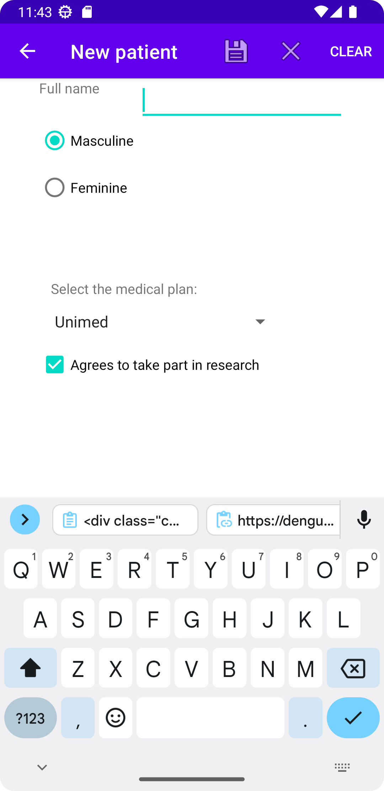
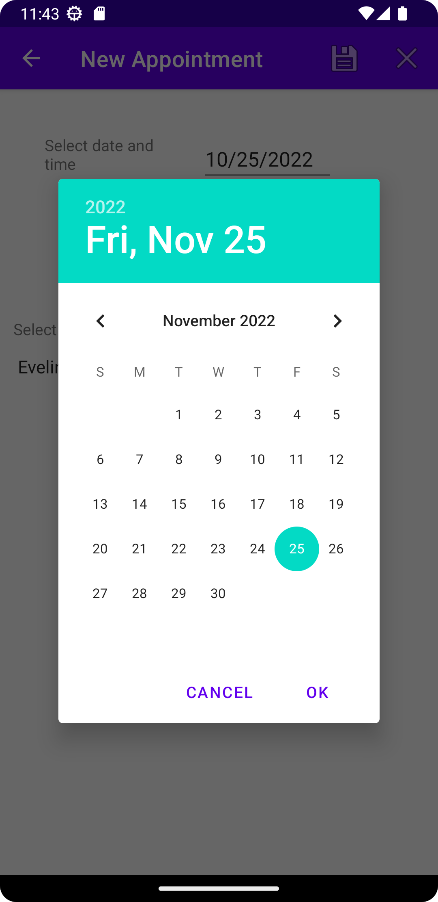

# Overview

This is an academic project to register patients and appointments.

It was made using Android Studio and Java.

Please take a look at <a href="https://parseiro.github.io/portfolio/dist">my portfolio here</a>.

<h2>Main screen</h2>

<h2>Patients list</h2>

<h2>New patient</h2>

<h2>Appointments</h2>

<h2>New appointment</h2>

